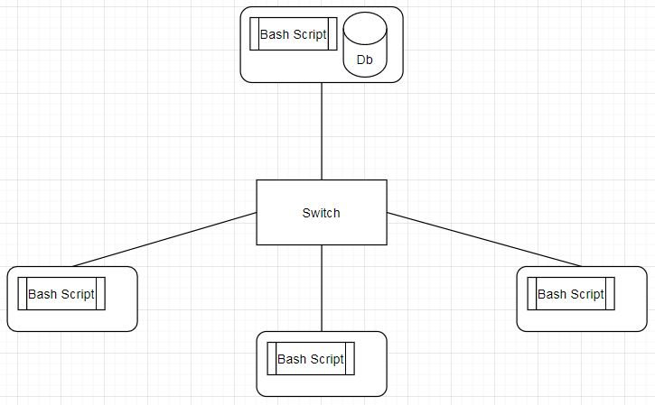

# Linux Clustering Monitoring Agent

# Introduction
The Jarvis Linux Cluster Administration team manages a cluster of 10 linux nodes. The nodes are running CentOS and they are connected internally via switch.
The  goal of this project is to monitor the hardware and memory usage of each node in this cluster. The hardware specifications are noted once whereas the 
memory usage scripts is run automatically every minute using Crontab.
The technologies used int this project are Docker, Git, Bash, SQL and Google Cloud Platform.

# Quick Start
This is a quick guide for start commands to be used in this project
- Psql instance is started using psql_docker.sh
```
    bash psql_docker.sh start
    psql -h hostname -U username -p 5432
```
- Tables are created using ddl.sql
```
    psql -h localhost -U postgres -d host_agent -f sql/ddl.sql
```
- Run host_info.sh to insert hardware specifications
```
    bash host_info.sh psql_host psql_port db_name psql_user psql_password
```
- Run host_usage.sh to insert memory usage
```
    bash host_usage.sh psql_host psql_port db_name psql_user psql_password
```
- Set up Crontab
```
    crontab -e
    //Type this in the file
    * * * * * bash <pwd>/host_usage.sh psql_host psql_port db_name psql_user psql_password > /tmp/host_usage.log
    crontab -l
```
 
# Implementation
The psql_docker.sh script was set up in order to create a psql container. After this, the ddl.sql script was implemented to create the tables. The next step was to 
create the bash scripts - host_info.sh and host_usage.sh. These scripts collected the data using bash commands and stored them into the tables. Crontab was
set up to run host_usage.sh every minute. At last


## Architecture


# Scripts
The following scripts were implemented in this project
- psql_docker.sh : Bash script to create a Psql image and run it
- host_info.sh : Bash script to obtain hardware specifications
- host_usage.sh : Bash script to obtain memory usage
- ddl.sql : SQL script to create tables
- queries.sql : SQL script to run queries on the tables to detect hardware failure in the cluster

# Database Modeling
Schema of each table 
host_info
Column | Type | Description 
--------------|------|--------------
id | `SERIAL PK` | Serial number used as primary key
hostname | `VARCHAR` | Name of the host machine
cpu_number | `INTEGER` | Number of CPUs
cpu_architecture | `VARCHAR` | System's bit instruction set
cpu_model | `VARCHAR` | Model of the CPU
cpu_mhz | `INTEGER` | Speed of the CPU in mhz
L2_cache | `INTEGER` | Storage of the L2 cache in `kB`
total_mem | `INTEGER` | Total memory in `kB`
timestamp | `TIMESTAMP` | Time in `UTC`


host_usage
Column | Type | Description 
--------------|------|--------------
timestamp | `TIMESTAMP` | Time in `UTC`
host_id | `SERIAL FK` | id of the host used as Foreign Key
memory_free | `INTEGER` | Memory not in use in `MB`s
cpu_idle | `INTEGER` | Percentage of cpu not in use
cpu_kernel | `INTEGER` | Perecentage of kernel cpu in use 
disk_io | `INTEGER` | Number of disk I/O
disk_available | `INTEGER` | Available memory in root directory `MB`


# Test
The bash scripts and SQL queries were tested manually. 
- The tables were checked for updates after running the scripts. 
- The result of the queries was double checked with
the content in the table.

# Improvements
- Create a bash script to set up Crontab
- Set up Crontab automation for hardware specifications
